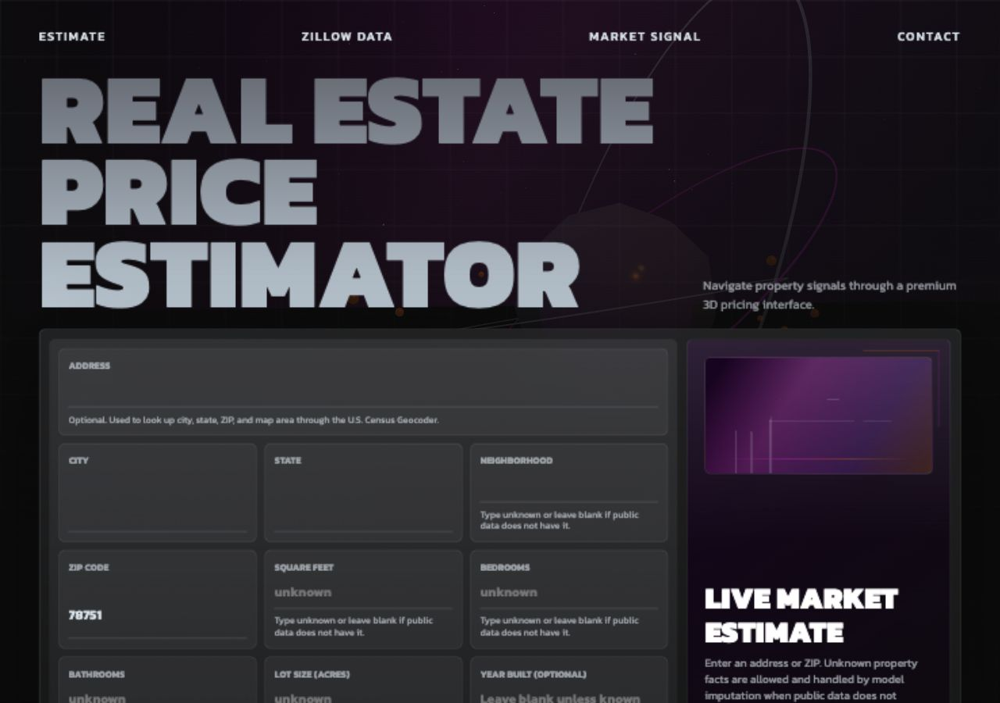
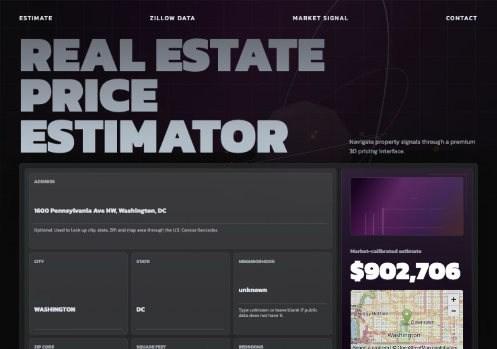
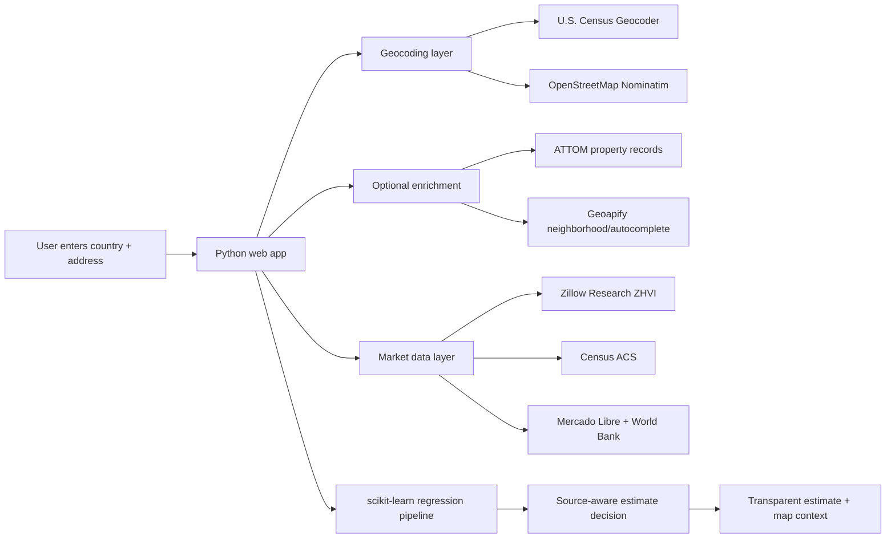

# Property Valuation Workbench

**Portfolio project by Joshue Torres**

A production-style real estate valuation workbench that verifies locations, maps properties, checks public data coverage, and produces transparent market-aware estimates without pretending unavailable property data is known.



## Public Links

- Live GitHub Pages app: [josuetorresf2.github.io/real-estate-price-estimator](https://josuetorresf2.github.io/real-estate-price-estimator/)
- Repository: [github.com/josuetorresf2/real-estate-price-estimator](https://github.com/josuetorresf2/real-estate-price-estimator)

The GitHub Pages version is a functional browser app. It verifies and maps addresses with OpenStreetMap/Nominatim, accepts property facts, resets stale data when the country changes, and returns a transparent estimate range directly in the browser.

The Python backend in `src/` remains available for local development and Docker hosting. GitHub Pages cannot execute Python, so the hosted `github.io` app uses a client-side estimator designed for public portfolio access.

## Why This Project Exists

Most demo price estimators are technically simple but product-wise weak: they ask users for data they may not know, hide source quality, and return a confident-looking number even when the data is thin.

This project is built to show stronger software engineering judgment. It treats valuation as a data-quality problem first and a regression problem second. The app verifies addresses, enriches fields from public/provider APIs when possible, shows map context, explains every estimate method, and refuses fake precision when the signal is not strong enough.

## What It Demonstrates

- Full-stack product thinking with a usable browser app, not only a notebook or CLI model.
- Regression pipeline design with scikit-learn, model persistence, and repeatable training.
- Real public-data integration across U.S. and South American markets.
- Source-aware estimation logic that changes behavior based on data quality.
- Country-aware UX with address suggestions, map selection, and stale-data clearing.
- Docker-ready deployment structure for a public demo.
- Automated verification with pytest and one-command project checks.

## Live Product Experience

The app opens as a dark glass valuation workbench with an animated 3D background, loading state, live address intelligence, source-status panels, map preview, and an evidence-first estimate card.

Key UI behavior:

- Country is a real dropdown, so users can click the arrow or use the keyboard to switch markets.
- Changing country clears the previous address, city, region, postal code, property facts, suggestions, map context, and old estimate.
- Address entry supports short fragments such as `5324` and returns broad options that can be narrowed with city or country.
- Verified locations fill city, state/region, ZIP/postal code, coordinates, distance to city center, and provider-backed fields when available.
- Unknown property facts are allowed, but the UI labels missing data instead of hiding uncertainty.



## Supported Example Searches

Select a country first, then paste the matching address or place text into `Address`.

| Country | Example | Expected behavior |
| --- | --- | --- |
| United States | `1701 Wynkoop St Denver CO` | Verifies with Census, fills city/state/ZIP, maps the property, and can use Zillow ZIP-level ZHVI. |
| Ecuador | `La Carolina Quito` | Verifies with OpenStreetMap/Nominatim and shows Ecuador regional context. |
| Brazil | `Avenida Paulista Sao Paulo` | Verifies location and can use Brazil regional listing/macro context. |
| Peru | `Miraflores Lima` | Verifies district/city context and shows Peru regional context. |
| Colombia | `El Poblado Medellin` | Verifies location context and shows Colombia regional context. |
| Chile | `Providencia Santiago` | Verifies location context and shows Chile regional context. |

## Core Features

- Country-aware location lookup for the United States, Ecuador, Brazil, Peru, Colombia, and Chile.
- Live address suggestions with no-key public geocoding fallback.
- Map-click reverse geocoding for location refinement.
- U.S. ZIP-level market anchoring through Zillow Research ZHVI.
- Optional U.S. Census ACS median home value signal.
- Optional ATTOM property facts for square footage, beds, baths, lot size, and year built.
- Optional Geoapify neighborhood/suburb enrichment.
- Optional Google Street View and Mapbox visual context.
- Regional South America context through OpenStreetMap, Mercado Libre public search where available, and World Bank indicators.
- Model guardrails that avoid using the trained model when core property facts are missing.

## Estimation Strategy

The project separates **property-level estimates** from **market baselines**.

| Data available | App behavior |
| --- | --- |
| Core property facts plus public market signal | Runs the model and calibrates against public market data. |
| Zillow ZIP signal but missing property facts | Returns a ZIP-level market baseline with a wider range. |
| Census ACS signal but missing property facts | Returns a government median-value baseline with low confidence. |
| Regional listing signal outside the U.S. | Returns a clearly labeled regional listing baseline, not an appraisal. |
| No public pricing baseline and no core facts | Asks for more property facts or a more specific verified address. |

This is intentional. A useful valuation app should explain uncertainty instead of manufacturing precision.

## Architecture



## Tech Stack

| Area | Tools |
| --- | --- |
| Backend | Python standard-library HTTP server |
| ML pipeline | scikit-learn, pandas, joblib |
| Frontend | Server-rendered HTML, CSS, JavaScript, local Three.js asset |
| U.S. data | Zillow Research, U.S. Census Geocoder, optional ACS |
| Global data | OpenStreetMap/Nominatim, World Bank, Mercado Libre public search |
| Optional providers | ATTOM, Geoapify, Google Street View, Mapbox |
| Deployment | GitHub Pages static app, Docker for Python backend |
| Verification | pytest, `verify.sh` |

## Data Sources and Honesty

- **Zillow Research ZHVI**: U.S. ZIP-level typical home value data. This is not an address-level Zestimate.
- **U.S. Census Geocoder**: U.S. address verification and coordinates.
- **U.S. Census ACS 5-year B25077**: optional median owner-occupied home value by ZIP Code Tabulation Area.
- **OpenStreetMap Nominatim**: global geocoding and reverse geocoding.
- **Geoapify**: optional autocomplete and neighborhood/suburb enrichment.
- **ATTOM**: optional U.S. address-level property records.
- **Mercado Libre public search**: regional listing context when the public endpoint returns data.
- **World Bank Indicators API**: country-level macro context for supported South American markets.
- **Mapbox / Google Street View**: optional visual map or exterior context.

Outside the United States, the app does not claim Zillow-style address-level valuation coverage. It verifies the location, maps the property area, and adds regional context when public APIs return usable data.

## Local Setup

```bash
python -m venv .venv
source .venv/bin/activate
pip install -r requirements.txt
./verify.sh
```

Run the app:

```bash
PYTHONPATH=src python -m real_estate_price_estimator.web_app --port 8000
```

Open:

```text
http://127.0.0.1:8000
```

## Optional API Keys

The app works without paid provider keys, but optional providers improve field enrichment and visual context.

```bash
export CENSUS_API_KEY=your_census_key_here
export ATTOM_API_KEY=your_attom_key_here
export GEOAPIFY_API_KEY=your_geoapify_key_here
export GOOGLE_STREET_VIEW_API_KEY=your_google_maps_key_here
export MAPBOX_ACCESS_TOKEN=your_mapbox_token_here
PYTHONPATH=src python -m real_estate_price_estimator.web_app --port 8000
```

Do not commit real API keys. Use local environment variables or deployment secrets.

## Docker

```bash
docker build -t property-valuation-workbench .
docker run --rm -p 8000:8000 property-valuation-workbench
```

## GitHub Pages Deployment

The public portfolio app is served from `docs/index.html`.

GitHub Pages settings:

- Source branch: `main`
- Source folder: `/docs`
- Public URL: `https://josuetorresf2.github.io/real-estate-price-estimator/`

This is the link to share with recruiters and visitors.

## Training and CLI Usage

Generate deterministic sample data:

```bash
python scripts/generate_sample_data.py
```

Train a model:

```bash
python -m real_estate_price_estimator.cli train \
  --data data/sample_housing.csv \
  --model-out models/price_pipeline.joblib
```

Predict from the CLI:

```bash
python -m real_estate_price_estimator.cli predict \
  --model models/price_pipeline.joblib \
  --city Austin \
  --neighborhood unknown \
  --zip-code 78751 \
  --square-feet 1850 \
  --bedrooms 3 \
  --bathrooms 2 \
  --lot-size 0.18 \
  --school-rating 8.6 \
  --distance-to-city-center-miles 4.2 \
  --crime-index 31
```

## Verification

```bash
./verify.sh
```

Current verification covers:

- Pipeline training and prediction.
- Unknown/blank property field parsing.
- Zillow Research ZHVI parsing and blending.
- Optional Census ACS blending logic.
- Address lookup and reverse geocoding.
- Country-aware suggestion routes and dropdown rendering.
- Data-quality-aware estimate decisions.
- Browser route rendering.

## Project Structure

```text
real-estate-price-estimator/
  src/real_estate_price_estimator/
    cli.py
    market_data.py
    pipeline.py
    web_app.py
  scripts/
    generate_sample_data.py
  tests/
  data/
  docs/images/
  static/vendor/
  Dockerfile
  render.yaml
  verify.sh
```

## Roadmap

- Add persistent caching for geocoding and provider responses.
- Add country-specific property-record adapters where reliable APIs are available.
- Normalize comparable listings by country, currency, and property type.
- Add confidence scoring by source freshness and geographic precision.
- Add hosted demo screenshots generated from a deployed environment.
- Add end-to-end browser tests for each supported country example.

## Portfolio Notes

This project is not an appraisal product. It is a valuation workbench designed to demonstrate practical engineering around messy real-world data: provider fallbacks, missing fields, country-specific behavior, model guardrails, and transparent user-facing explanations.
